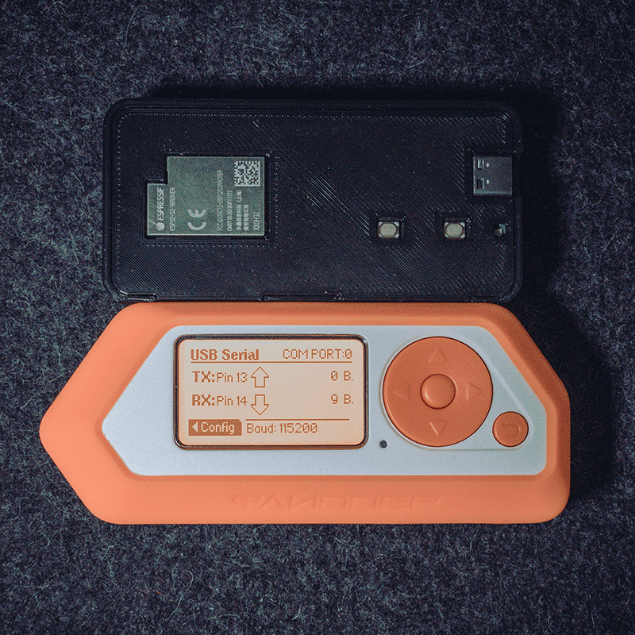

# ESP32-Rick-Roll

<figure>

</figure>

Arduino code for beacon spamming a Rick Roll.

This is a bare bones implementation of the Rick Roll beacon spam that is implemented in the Marauder ESP32 firmware. I took on this task because I could not get the [ESP32 Beacon Spam](https://github.com/Tnze/esp32_beaconSpam) script running out of the box. In addition, I did not want to install the [Marauder firmware](https://github.com/justcallmekoko/ESP32Marauder) since I don't know much about it yet. So instead, I decided to use both as a starting point to write my own.

The code can be flashed to the ESP32 board using the current Arduino IDE (> 2.0.0) after setting up the IDE to be compatible with the ESP32. There are plenty of guides on how to set this up.

Enjoy!
